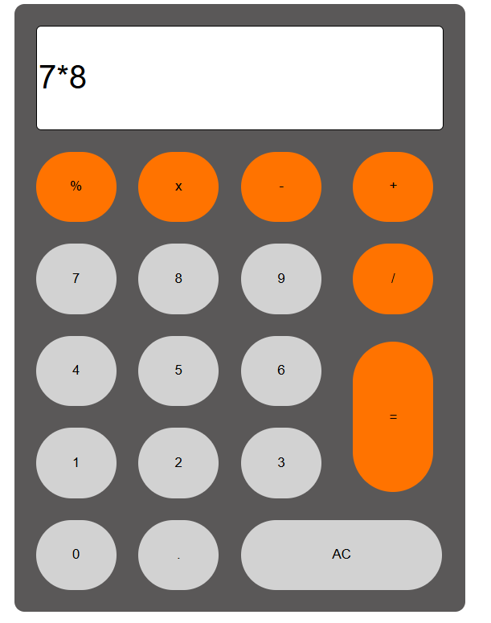

### ✅ README.md for Calculator Project

# 🧮 Calculator Web App

A simple calculator built using **HTML**, **CSS**, and **JavaScript** that performs basic arithmetic operations like **Addition**, **Subtraction**, **Multiplication**, and **Division**.

## 📸 Screenshot



## ⚙️ Features

-   ➕ Addition
-   ➖ Subtraction
-   ✖️ Multiplication
-   ➗ Division
-   🔄 Clear/Reset button
-   💯 Responsive Design (optional, if implemented)

## 💻 Technologies Used

-   **HTML5**
-   **CSS3**
-   **Vanilla JavaScript**

## 🚀 How to Run

1. Clone or download the repository.
2. Open the folder.
3. Double-click on `index.html` or open it in your browser.

```bash
git clone https://github.com/Kavya75340/Calculator.git
cd Calculator
start index.html
```

> ✅ No need to install anything! It runs directly in the browser.

## 📁 Project Structure

```
calculator/
├── index.html
├── style.css
├── script.js
└── screenshots/
    └── calculator.png
```

## 📬 Contact

**Created By:** Kavya Varshney
📧 Email: \[[KvVarshney\kvvarshney75@gmail.com](mailto:kvvarshney75@gmail.com)]
🔗 LinkedIn: [linkedin.com/in/kavya-varshney](https://www.linkedin.com/in/kavya-varshney-658803327/)

---
